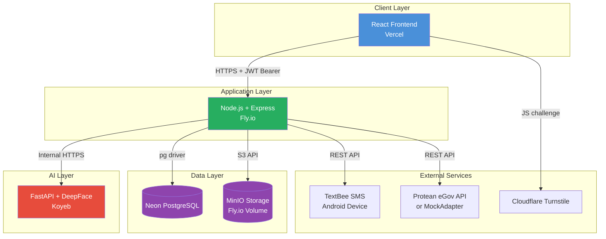
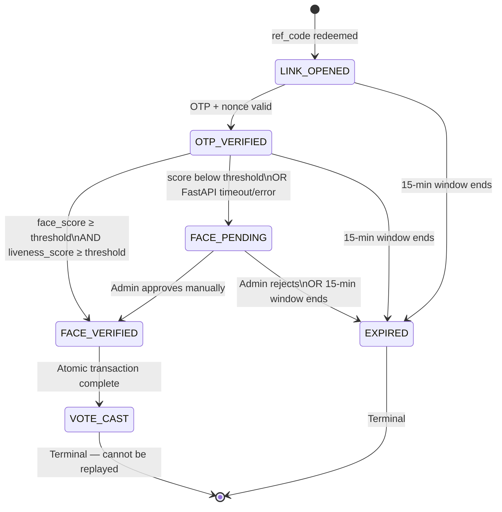
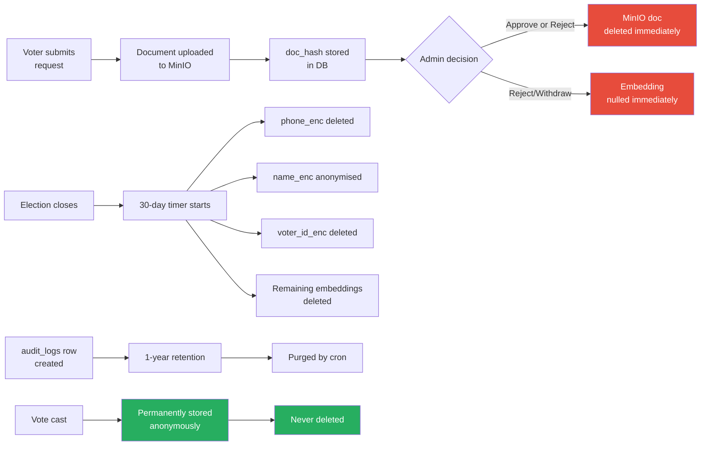
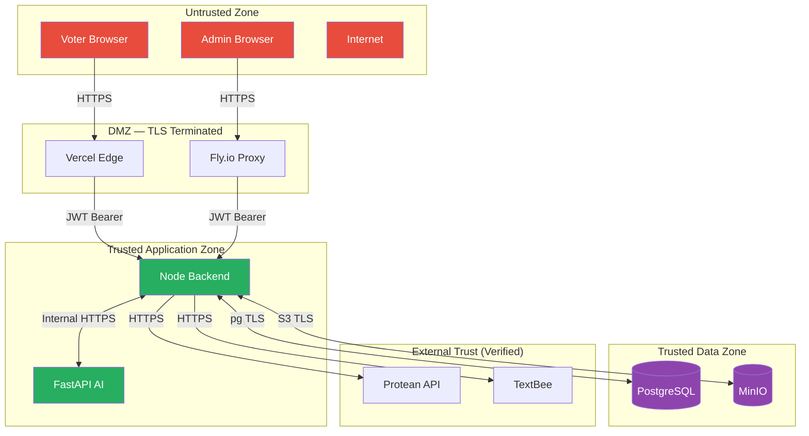

# VerifiedVote — Complete Master Build Prompt (v3)

## Project Overview

Build **VerifiedVote**, a secure, AI-assisted remote voting authorization platform for official
government elections. The platform enables verified exceptional-case voters — disabled citizens,
deployed military personnel, NRIs, and remote workers — to vote remotely through a controlled,
auditable, multi-admin-approved workflow.

This is **not** a general-purpose voting platform. It is an official election platform only,
designed to digitize the postal ballot workflow with stronger identity verification. It targets
India's election context.

**Regulatory disclaimer:** This system is designed as a civic-tech platform and requires
institutional integration and regulatory approval before use in any official election. It is not
ECI-approved or government-certified software in its current form.

**Pitch framing:** "A remote voting authorization system for verified exceptional cases —
digitizing the postal ballot workflow for voters who cannot physically reach polling stations."

**Core principle:** Every design decision prioritizes accessibility, security, auditability, and
legal defensibility over technical complexity.

---

## Threat Model

### Threats Considered and Mitigated

| Threat | Mitigation |
|---|---|
| Stolen OTP | OTP bound to session nonce; bcrypt hashed; short expiry; attempt count tracked |
| SIM swap | FACE_PENDING fallback; admin manual review; audit trail |
| OTP replay | Session nonce single-use; OTP invalidated on resend or successful use |
| OTP forwarding to different session | OTP bound to exchange_nonce created at link-open time |
| Brute force OTP | Max 3 attempts per voter per hour; attempt_count in otps table |
| Printed photo spoofing | Passive liveness (OpenCV Laplacian variance + FFT texture analysis) |
| Screen replay spoofing | Passive liveness frequency analysis detects flat screen texture |
| Deepfake stream | Partially mitigated by passive liveness; documented limitation |
| Duplicate voting | VOTE_CAST terminal state; atomic transaction; unique receipt_token |
| JWT theft | Bearer token over HTTPS only; never in SMS; session revocation on compromise |
| Voting link sharing | OTP required on open; OTP bound to exchange_nonce |
| SMS interception | Opaque ref code only — not JWT; ref code single-use |
| Ref code replay | Ref code marked used immediately; 2-min exchange_nonce window |
| Race condition on vote submission | Atomic DB transaction: validate → insert → invalidate → receipt → audit |
| Admin misuse | Multi-admin approval; all actions immutably logged; role separation |
| Single admin trust | Two-stage approval for critical actions (Reviewer + Super Admin) |
| Insider DB attack | Votes permanently anonymous; no voter_id in votes table |
| Timestamp re-identification | cast_at rounded to nearest minute; not exact timestamp |
| Malicious document upload | MIME type validation; file size limit; extension whitelist; hash stored |
| XSS via free-text fields | DOMPurify frontend; server-side HTML stripping before storage |
| SQL injection | Parameterised queries throughout; no string concatenation |
| Voter ID enumeration | Rate limiting on verify-voter; no enumerable error differences |
| Excessive login abuse | Turnstile CAPTCHA triggered after 3 failures per IP in 15 minutes |
| DDoS | Rate limiting per IP; Fly.io DDoS protection; Turnstile fallback |
| Constituency fraud | Server-side constituency match; DB-level election filtering |
| Audit log tampering | audit_logs and request_events append-only; no UPDATE/DELETE via API |
| Cron job race condition | Postgres advisory locks on all scheduled jobs |
| Document URL exposure | MinIO private buckets; signed short-lived URLs (15-min expiry) |
| Biometric data breach | Embeddings encrypted at rest (pgcrypto); auto-deleted 30 days post-election |
| Stolen active session token | is_revoked flag checked on every request; Super Admin can revoke |

### Threats Explicitly Out of Scope

- Nation-state infrastructure compromise
- Telecom provider-level SIM cloning at carrier level
- Physical coercion of voter during session (partially mitigated by privacy screen)
- Fully compromised voter device (malware, keylogger)
- Full database server takeover with root access
- Sophisticated real-time deepfake attacks
- Supply chain attacks on open-source dependencies

### Passive Liveness Limitation (Documented Honestly)

Passive liveness detection (OpenCV Laplacian variance + FFT analysis) provides limited spoof
resistance. It detects printed photographs and basic screen replays but is **not** designed to
defeat sophisticated deepfake attacks. It is a risk-reduction layer, not a biometric guarantee.
This limitation is intentional and acceptable for an open-source civic-tech prototype.

---

## STRIDE Analysis

| Component | Spoofing | Tampering | Repudiation | Info Disclosure | DoS | Privilege Escalation |
|---|---|---|---|---|---|---|
| Voter login | Protean check + OTP bcrypt | JWT signature | audit_logs | HTTPS only | Rate limit + Turnstile | Role claim in JWT |
| OTP flow | bcrypt hash + session nonce | Nonce binding | otps table log | Never plaintext | Attempt count limit | N/A |
| Ref code / link | Opaque + single-use | exchange_nonce | voting_sessions log | Not a JWT | 15-min expiry | N/A |
| Face verification | DeepFace + liveness | Embedding encrypted | verification_logs | Memory-only processing | FACE_PENDING fallback | N/A |
| Vote submission | Session state checked | Atomic transaction | audit_logs + receipt | No voter_id stored | One-time session | N/A |
| Admin actions | bcrypt + JWT role | Immutable event log | request_events | Role-separated access | Rate limit | Role claim; no self-elevate |
| Results | System-computed only | Hash + snapshot | audit_logs | Anonymous only | Admin-triggered only | Super Admin + confirm |
| Audit logs | Admin JWT required | Append-only | Self-evidencing | Role-gated viewer | N/A | Super Admin only |
| MinIO documents | Signed URLs | Hash verification | Deletion logged | Private buckets only | Short-lived URLs | Backend only |
| Cron jobs | Advisory lock | Idempotent design | cron_jobs table | Internal only | Lock prevents double-run | System actor only |

---

## Tech Stack

| Layer | Technology | Notes |
|---|---|---|
| Frontend | React + Vite | Tailwind CSS, React Router v6, React Query, Axios, react-i18next |
| Backend | Node.js + Express | JWT, bcrypt, node-cron, express-rate-limit, multer, pg |
| Database | Neon PostgreSQL | pgcrypto, node-pg-migrate, advisory locks |
| AI Service | Python FastAPI + DeepFace | VGG-Face model + OpenCV passive liveness |
| SMS | TextBee | Android phone gateway; abstracted behind SMSService |
| File Storage | MinIO | Self-hosted, S3-compatible, private buckets, signed URLs |
| Voter Verification | Protean eGov API | MockAdapter (dev) / ProteanAdapter (prod) |
| Scheduler | node-cron | Inside Express; Postgres advisory locks prevent double-run |
| Encryption | pgcrypto | Symmetric encryption for all PII columns |
| OTP Hashing | bcrypt (cost 10) | Never SHA-256 for OTPs; bcrypt prevents brute force |
| Auth | JWT Bearer token | Authorization header only; never cookies |
| Admin Password Hashing | bcrypt (cost 12) | Higher cost for long-lived credentials |
| Input Sanitisation | DOMPurify + sanitize-html | Frontend and backend both sanitise all free text |
| Rate Limiting | express-rate-limit | Per endpoint, per IP |
| CAPTCHA | Cloudflare Turnstile | Triggered on excessive auth failures; no user puzzle required |
| Frontend Deploy | Vercel | Free tier |
| Backend Deploy | Fly.io | Free tier; sub-1s cold start |
| AI Service Deploy | Koyeb | Free tier; GPU support; no cold starts |
| Database Deploy | Neon PostgreSQL | Free tier; 0.5 GB storage |
| File Storage Deploy | Fly.io volume or $5 VPS | Self-hosted MinIO |

---

## Architecture Diagrams

### A. System Architecture



### B. Voting Session Sequence

```mermaid
sequenceDiagram
    participant V as Voter
    participant FE as Frontend
    participant BE as Backend
    participant AI as FastAPI
    participant DB as Database
    participant SMS as TextBee

    SMS->>V: ref_code link (scheduled_at)
    V->>FE: Opens link (ref=ABC123)
    FE->>BE: POST /session/open {ref_code}
    BE->>DB: Validate ref_code; mark used
    BE->>DB: Create session (LINK_OPENED)
    BE->>DB: Generate exchange_nonce
    BE->>SMS: Send OTP (bound to nonce)
    SMS->>V: OTP via SMS

    V->>FE: Enter OTP + nonce
    FE->>BE: POST /session/verify-otp
    BE->>DB: bcrypt.compare(otp, hash)
    BE->>DB: Update state → OTP_VERIFIED
    BE->>FE: Issue JWT (15-min)

    V->>FE: Take selfie
    FE->>BE: POST /session/verify-face {image_b64}
    BE->>DB: Get stored embedding
    BE->>AI: POST /verify {embedding, image}
    AI->>BE: {match, face_score, liveness_score}

    alt Scores pass threshold
        BE->>DB: Update state → FACE_VERIFIED
        BE->>FE: Show ballot
        V->>FE: Select candidate
        FE->>BE: POST /vote/submit {candidate_id}
        BE->>DB: BEGIN TRANSACTION
        DB->>DB: Validate session FACE_VERIFIED
        DB->>DB: INSERT vote (no voter_id)
        DB->>DB: UPDATE session → VOTE_CAST
        DB->>DB: INSERT receipt_token
        DB->>DB: INSERT audit_log
        DB->>DB: COMMIT
        BE->>SMS: Send receipt token
        SMS->>V: Vote confirmed + receipt
    else Scores below threshold
        BE->>DB: Update state → FACE_PENDING
        BE->>FE: Show pending message
        Note over BE,DB: Admin reviews manually
    end
```

### C. Session State Machine



### D. Data Lifecycle



### E. Trust Boundary Diagram



---

## Complete Database Schema

### Encryption Strategy

- `pgp_sym_encrypt` / `pgp_sym_decrypt` for all PII columns
- Encrypted columns stored as `bytea`
- Separate SHA-256 hash columns for lookups (voter_id_hash)
- OTPs hashed with bcrypt (cost 10) — never SHA-256
- Encryption key in environment variable `PGCRYPTO_KEY`

---

### `admins`
```sql
id              uuid PRIMARY KEY DEFAULT gen_random_uuid()
username        text NOT NULL UNIQUE
password_hash   text NOT NULL          -- bcrypt cost 12
role            text NOT NULL          -- 'super_admin' | 'reviewer'
is_active       boolean DEFAULT true
last_login_at   timestamptz
created_at      timestamptz DEFAULT now()
```
> Seeded via migration script and environment variables only.
> No API endpoint creates, updates, or deletes admins.
> No password reset flow. Super Admin password reset = documented operational DB procedure.

---

### `parties`
```sql
id              uuid PRIMARY KEY DEFAULT gen_random_uuid()
name            text NOT NULL UNIQUE
abbreviation    text
symbol_minio_key text                  -- MinIO object key for party symbol
is_active       boolean DEFAULT true
created_by      uuid REFERENCES admins(id)
created_at      timestamptz DEFAULT now()
updated_at      timestamptz DEFAULT now()
```
> Super Admin CRUD only. Soft delete (is_active=false).
> Hard delete only if zero associated candidates.
> All party operations logged to audit_logs.

---

### `voters`
```sql
id                  uuid PRIMARY KEY DEFAULT gen_random_uuid()
voter_id_hash       text NOT NULL UNIQUE   -- SHA-256 for lookups
voter_id_enc        bytea NOT NULL          -- pgcrypto encrypted
name_enc            bytea NOT NULL          -- pgcrypto encrypted
phone_enc           bytea NOT NULL          -- pgcrypto encrypted
constituency        text NOT NULL           -- plaintext for DB-level filtering
state               text NOT NULL
created_at          timestamptz DEFAULT now()
data_expires_at     timestamptz             -- election_close_date + 30 days
```
> Created on first successful Protean verification + OTP. No registration form.

---

### `elections`
```sql
id                      uuid PRIMARY KEY DEFAULT gen_random_uuid()
name                    text NOT NULL
constituency            text NOT NULL
state                   text NOT NULL
election_date           date NOT NULL
request_deadline        timestamptz NOT NULL
status                  text NOT NULL DEFAULT 'draft'
  -- 'draft' | 'active' | 'voting' | 'closed' | 'results_published'
results_hash            text               -- SHA-256 of results_snapshot JSON
results_snapshot        jsonb              -- immutable; set at publish time
results_published_at    timestamptz
created_by              uuid REFERENCES admins(id)
activated_by            uuid REFERENCES admins(id)
created_at              timestamptz DEFAULT now()
updated_at              timestamptz DEFAULT now()
```

---

### `election_settings`
```sql
id                          uuid PRIMARY KEY DEFAULT gen_random_uuid()
election_id                 uuid REFERENCES elections(id) UNIQUE NOT NULL
face_match_threshold        float DEFAULT 0.6
liveness_threshold          float DEFAULT 0.4
session_window_minutes      int DEFAULT 15
withdrawal_deadline_hours   int DEFAULT 48
max_otp_attempts            int DEFAULT 3
created_at                  timestamptz DEFAULT now()
updated_at                  timestamptz DEFAULT now()
```
> Locked (no further updates) once election.status = 'active'.

---

### `candidates`
```sql
id              uuid PRIMARY KEY DEFAULT gen_random_uuid()
election_id     uuid REFERENCES elections(id) NOT NULL
party_id        uuid REFERENCES parties(id) NOT NULL
name            text NOT NULL
display_order   int NOT NULL
created_at      timestamptz DEFAULT now()
```
> Party linked via FK — no free-text party name.

---

### `otps`
```sql
id              uuid PRIMARY KEY DEFAULT gen_random_uuid()
voter_id        uuid REFERENCES voters(id) NOT NULL
otp_hash        text NOT NULL          -- bcrypt(otp, cost=10); NEVER plaintext or SHA-256
session_nonce   text NOT NULL          -- exchange_nonce this OTP is bound to
expires_at      timestamptz NOT NULL
attempt_count   int DEFAULT 0
invalidated_at  timestamptz            -- set on new OTP issued, or on successful use
created_at      timestamptz DEFAULT now()
```
> New OTP row sets invalidated_at = now() on ALL previous rows for this voter_id.
> Verified by: bcrypt.compare(input_otp, stored_hash) AND now() < expires_at
>   AND invalidated_at IS NULL AND attempt_count < max_otp_attempts.

---

### `voting_requests`
```sql
id                              uuid PRIMARY KEY DEFAULT gen_random_uuid()
voter_id                        uuid REFERENCES voters(id) NOT NULL
election_id                     uuid REFERENCES elections(id) NOT NULL
reason_category                 text NOT NULL
  -- 'medical' | 'military' | 'abroad' | 'remote_work'
reason_detail                   text               -- sanitised
doc_type                        text NOT NULL
  -- 'disability_cert' | 'army_id' | 'posting_letter' | 'passport'
  -- | 'visa' | 'work_contract' | 'hospital_letter'
doc_minio_key                   text               -- MinIO object key; encrypted ref
doc_hash                        text               -- SHA-256 at upload time
request_selfie_embedding_enc    bytea              -- nulled on rejection or withdrawal
face_score_at_request           float
liveness_score_at_request       float
status                          text NOT NULL DEFAULT 'pending'
  -- 'pending' | 'under_review'
  -- | 'reviewer_approved' | 'superadmin_approved' | 'final_approved'
  -- | 'rejected' | 'scheduled' | 'withdrawn'
  -- | 'appealed' | 'appeal_under_review' | 'appeal_resolved'
  -- | 'voting_completed'
reviewed_by_reviewer            uuid REFERENCES admins(id)
reviewer_note                   text               -- sanitised
reviewed_by_superadmin          uuid REFERENCES admins(id)
superadmin_note                 text               -- sanitised
scheduled_at                    timestamptz
withdrawn_at                    timestamptz
appeal_doc_minio_key            text
appeal_submitted_at             timestamptz
created_at                      timestamptz DEFAULT now()
updated_at                      timestamptz DEFAULT now()
```

**Partial unique index (correct implementation):**
```sql
CREATE UNIQUE INDEX unique_active_request_idx
ON voting_requests(voter_id, election_id)
WHERE status NOT IN ('rejected', 'withdrawn', 'appeal_resolved');
```
> One active request per voter per election at DB level.
> `appeal_resolved` (final rejection) included so voter is not permanently blocked
> from reapplying in a future election cycle.

---

### `request_events`
```sql
id              uuid PRIMARY KEY DEFAULT gen_random_uuid()
request_id      uuid REFERENCES voting_requests(id) NOT NULL
old_status      text NOT NULL
new_status      text NOT NULL
actor_id        uuid NOT NULL
actor_type      text NOT NULL      -- 'admin' | 'voter' | 'system'
reason          text
metadata        jsonb
created_at      timestamptz DEFAULT now()
```
> **Append-only. No UPDATE or DELETE via any API ever.**
> Row inserted BEFORE voting_requests.status is updated. This is Invariant 13.

---

### `voting_sessions`
```sql
id                      uuid PRIMARY KEY DEFAULT gen_random_uuid()
request_id              uuid REFERENCES voting_requests(id) UNIQUE NOT NULL
ref_code                text UNIQUE NOT NULL       -- 12-char opaque alphanumeric
ref_code_used           boolean DEFAULT false
ref_code_used_at        timestamptz
exchange_nonce          text UNIQUE                -- 2-min nonce; issued after ref code redemption
exchange_nonce_used     boolean DEFAULT false
token_hash              text UNIQUE                -- SHA-256 of issued JWT
state                   text NOT NULL DEFAULT 'link_opened'
  -- 'link_opened' | 'otp_verified' | 'face_verified'
  -- | 'face_pending' | 'vote_cast' | 'expired'
is_revoked              boolean DEFAULT false
revoked_at              timestamptz
revoked_by              uuid REFERENCES admins(id)
expires_at              timestamptz NOT NULL
otp_verified_at         timestamptz
face_verified_at        timestamptz
face_score              float
liveness_score          float
face_pending_reason     text
vote_cast_at            timestamptz
ip_address              inet
created_at              timestamptz DEFAULT now()
updated_at              timestamptz DEFAULT now()
```
> Every protected endpoint checks `is_revoked = false` before processing.
> Super Admin can revoke any active session from the monitoring dashboard.
> Revocation logged to audit_logs.

---

### `votes`
```sql
id              uuid PRIMARY KEY DEFAULT gen_random_uuid()
election_id     uuid REFERENCES elections(id) NOT NULL
candidate_id    uuid REFERENCES candidates(id) NOT NULL
receipt_token   text UNIQUE NOT NULL
cast_at         timestamptz DEFAULT date_trunc('minute', now())
```
> **No voter_id. No session_id. No request_id. Permanently anonymous.**
> `cast_at` rounded to nearest minute to reduce timestamp re-identification risk.
> This is Invariant 1.

---

### `notifications`
```sql
id              uuid PRIMARY KEY DEFAULT gen_random_uuid()
voter_id        uuid REFERENCES voters(id) NOT NULL
type            text NOT NULL
channel         text NOT NULL DEFAULT 'sms'
status          text NOT NULL DEFAULT 'pending'   -- 'pending' | 'sent' | 'failed'
retry_count     int DEFAULT 0
sent_at         timestamptz
next_retry_at   timestamptz                        -- set on failure for cron retry
failed_reason   text
created_at      timestamptz DEFAULT now()
```
> Failed sends: cron job picks up `status = 'failed' AND retry_count < 3`
> every 5 minutes. retry_count incremented on each attempt.
> This is the queue-ready SMS retry architecture (BullMQ upgrade path documented).

---

### `verification_logs`
```sql
id                  uuid PRIMARY KEY DEFAULT gen_random_uuid()
request_id          uuid REFERENCES voting_requests(id)
session_id          uuid REFERENCES voting_sessions(id)
verification_type   text NOT NULL     -- 'request_time' | 'voting_time'
face_score          float NOT NULL
liveness_score      float
face_threshold      float NOT NULL
liveness_threshold  float
face_passed         boolean NOT NULL
liveness_passed     boolean
overall_passed      boolean NOT NULL
model_used          text NOT NULL
duration_ms         int NOT NULL
created_at          timestamptz DEFAULT now()
```

---

### `audit_logs`
```sql
id                  uuid PRIMARY KEY DEFAULT gen_random_uuid()
actor_type          text NOT NULL     -- 'admin' | 'system' | 'voter'
actor_id            uuid NOT NULL
action              text NOT NULL
entity_type         text NOT NULL
entity_id           uuid
metadata            jsonb
ip_address          inet
request_id_header   text              -- x-request-id correlation
created_at          timestamptz DEFAULT now()
```
> **Append-only. No UPDATE or DELETE via any API ever.**
> Retained 1 year then purged by cron. Exportable as signed PDF by Super Admin.

---

### `cron_jobs`
```sql
id              uuid PRIMARY KEY DEFAULT gen_random_uuid()
job_name        text UNIQUE NOT NULL
last_run_at     timestamptz
last_status     text    -- 'success' | 'failed' | 'skipped'
last_error      text
updated_at      timestamptz DEFAULT now()
```

---

## Authentication Flow — No Registration

### Voter Login

1. Voter enters Voter ID
2. Client validates format: 1 letter + 7 alphanumeric (India Voter ID)
3. `POST /auth/verify-voter` — rate limited: **5 per IP per 15 minutes**
4. On 3+ failures from same IP in 15 minutes: Cloudflare Turnstile challenge injected
5. Server calls `VoterVerificationService`:
   - **Dev:** `MockAdapter` — reads `/seed/voter_roll.json`
   - **Prod:** `ProteanAdapter` — calls Protean eGov API
6. **Not found:** generic error (no enumerable difference between not-found and API error)
7. **Found:** upsert voter record. Generate OTP (6 digits). Hash with bcrypt(otp, 10).
   Insert into `otps`. Invalidate all previous otps for this voter_id.
   Send via TextBee.
8. `POST /auth/verify-otp`:
   - `bcrypt.compare(input, stored_hash)`
   - Check expires_at, invalidated_at, attempt_count < max
   - Increment attempt_count on failure
   - On success: issue voter JWT. Invalidate OTP row.
9. JWT: `{ voter_id, constituency, state, iat, exp: 24h }`
   Sent as `Authorization: Bearer <token>`. Never in cookies.

### Admin Login

1. `POST /admin/auth/login` — rate limited: **10 per IP per 15 minutes**
2. bcrypt comparison (cost 12)
3. JWT: `{ admin_id, role, iat, exp: 8h }`
4. All logins (success + failure) logged to audit_logs

---

## Voter Verification Service

```
VoterVerificationService
├── MockAdapter        (VOTER_VERIFY_MODE=mock)
│   ├── Reads /seed/voter_roll.json
│   ├── Simulates configurable network delay
│   └── Returns: { voter_id, name, phone, constituency, state }
└── ProteanAdapter     (VOTER_VERIFY_MODE=protean)
    ├── Calls Protean eGov Technologies API
    ├── Requires: PROTEAN_API_KEY, PROTEAN_API_URL
    └── Returns same interface as MockAdapter
```

Seed file covers: valid voter, invalid voter, wrong constituency voter, voter with existing request.

---

## SMS Service (Queue-Ready Architecture)

```
SMSService
├── TextBeeAdapter     (SMS_PROVIDER=textbee)
└── MSG91Adapter       (SMS_PROVIDER=msg91)      -- production swap
```

**Retry strategy (no Redis required for MVP):**
- SMS send fails → notification row status = 'failed', next_retry_at = now() + 5min
- Cron job every 5 minutes: picks up failed notifications with retry_count < 3
- Increments retry_count; attempts resend; updates status
- After 3 failures: status = 'failed' (permanent); admin dashboard alert raised

**BullMQ upgrade path:** Replace cron retry with BullMQ queue backed by Redis when
production reliability requires it. SMSService interface remains unchanged.

---

## File Storage — MinIO

**Operations:**
- `uploadDocument(fileBuffer, mimeType) → { key, hash }` — key is UUID-based; hash is SHA-256
- `getSignedUrl(key, expirySeconds=900) → url` — 15-min signed URL
- `deleteDocument(key)` — permanent; logged to audit_logs

**Lifecycle:**
- Upload at request submission → key stored in `doc_minio_key`
- Hash stored in `doc_hash` at upload time
- Signed URL generated for admin review (15-min expiry, never public)
- **Deleted from MinIO immediately on admin approval or rejection**
- If MinIO key inaccessible: doc_hash proves document existed; voter asked to resubmit
- Selfies **never stored** — embedding vector only, extracted and encrypted

---

## Constituency Enforcement

- Election has `constituency` + `state` set at creation
- Voter record stores `constituency` + `state` from Protean response
- **Request submission:** server enforces `voter.constituency === election.constituency`
- **Voter dashboard query:**
  ```sql
  WHERE elections.constituency = $voter_constituency
    AND elections.state = $voter_state
    AND elections.status IN ('active', 'voting')
  ```
- UI-level filtering is supplementary; DB-level is authoritative

---

## Multi-Admin Approval Workflow

### Request Approval

```
pending
  → under_review          (Reviewer opens request)
  → reviewer_approved     (Reviewer approves with note)
  → superadmin_approved   (Super Admin confirms with note)
  → final_approved        (System sets; session auto-scheduled)

  OR at any stage:
  → rejected              (Reviewer OR Super Admin; mandatory note)
```

Every transition: insert `request_events` row BEFORE updating `voting_requests.status`.

### Election Activation
- Super Admin creates election (draft)
- Super Admin activates (password re-entry required) → status = 'active'
- election_settings locked from this point

### Result Publication
- Super Admin triggers "Compute Results"
- System runs tally query; stores results_snapshot + results_hash
- Password re-entry required to confirm publication
- Status set to 'results_published'; immutable

---

## Appeals Workflow

```
rejected
  → appealed              (Voter submits + additional document)
  → appeal_under_review   (Super Admin only; not Reviewer)
  → appeal_resolved

On resolution:
  Approved → superadmin_approved → final_approved
  Rejected → rejected (final; no further appeal)
```

New document uploaded to MinIO on appeal submission.
SMS notifications 10 (appeal received) and 11 (appeal resolved) sent.
All appeal actions logged to request_events and audit_logs.

---

## Secure Voting Session — Replay-Protected Flow

```
1. System generates 12-char opaque ref_code at scheduled_at time
2. SMS: "verifiedvote.in/vote?ref=ABC123XYZ4PQ"
   — plain text URL; no JWT; no link shorteners
3. Voter opens link → validate ref_code (unused, not expired)
4. ref_code_used = true; ref_code_used_at = now()
5. Server generates exchange_nonce (UUID, 2-min expiry)
6. Session created: state = LINK_OPENED, expires_at = now() + 15min
7. SMS OTP sent (bound to exchange_nonce as session_nonce in otps table)
8. Voter submits OTP + exchange_nonce
9. bcrypt.compare(otp, hash) + nonce validation
10. exchange_nonce_used = true; OTP invalidated
11. JWT issued: { session_id, election_id, voter_id, iat, exp: 15min }
    token_hash stored in voting_sessions
12. State = OTP_VERIFIED
```

**Protected endpoint middleware checks:**
- JWT valid signature and not expired
- voting_sessions.is_revoked = false
- voting_sessions.state matches expected state for this endpoint
- voting_sessions.expires_at > now()

---

## Atomic Vote Transaction

```sql
BEGIN;
  -- 1. Validate session is FACE_VERIFIED and not expired or revoked
  SELECT id FROM voting_sessions
  WHERE id = $session_id
    AND state = 'face_verified'
    AND is_revoked = false
    AND expires_at > now()
  FOR UPDATE;

  -- 2. Insert vote (no voter_id, no session_id)
  INSERT INTO votes (election_id, candidate_id, receipt_token, cast_at)
  VALUES ($election_id, $candidate_id, gen_random_uuid(), date_trunc('minute', now()));

  -- 3. Update session state to VOTE_CAST
  UPDATE voting_sessions
  SET state = 'vote_cast', vote_cast_at = now()
  WHERE id = $session_id;

  -- 4. Insert audit log
  INSERT INTO audit_logs (actor_type, actor_id, action, entity_type, entity_id, metadata)
  VALUES ('voter', $voter_id, 'vote_cast', 'election', $election_id, $metadata);

COMMIT;
```

If any step fails, the entire transaction rolls back. No partial writes. This is Invariant 11.

---

## AI Face Verification Service

### Deployment: Koyeb (GPU support, no cold starts)
### Model loaded at service startup — not on first request

### Passive Liveness Detection (No User Action Required)

```python
def detect_print_attack(image: np.ndarray) -> float:
    """
    Returns liveness_score 0.0-1.0.
    Low score = likely printed photo or screen replay.
    High score = likely live face.
    """
    gray = cv2.cvtColor(image, cv2.COLOR_BGR2GRAY)

    # Laplacian variance — printed photos are softer/blurrier
    laplacian_var = cv2.Laplacian(gray, cv2.CV_64F).var()

    # FFT frequency analysis — printed photos lack high-frequency detail
    fft = np.fft.fft2(gray)
    fft_shift = np.fft.fftshift(fft)
    magnitude = np.log(np.abs(fft_shift) + 1)
    high_freq_energy = magnitude[magnitude > magnitude.mean()].mean()

    # Normalise and combine into single score
    score = min(1.0, (laplacian_var / 500 * 0.6) + (high_freq_energy / 10 * 0.4))
    return round(score, 4)
```

### API Contract

**`POST /verify`**

Request:
```json
{
  "reference_embedding": [0.123, -0.456, "...float array"],
  "live_image_b64": "base64_encoded_jpeg"
}
```

Response (200):
```json
{
  "match": true,
  "face_score": 0.82,
  "liveness_score": 0.76,
  "model": "VGG-Face",
  "duration_ms": 847
}
```

Error responses: `422` (invalid input), `500` (model error)

**Node timeout:** 10 seconds.
**On timeout or 5xx:** state → FACE_PENDING; admin flagged; voter never auto-rejected.

**`GET /health`** → `{ "status": "ok", "model": "loaded" }`

### Processing Rules
- Images processed in memory only — never written to disk
- Embeddings stored encrypted in DB; decrypted only for verification call
- Threshold read from `election_settings` per request (not hardcoded)
- Full result logged to `verification_logs`

---

## Party Management (Super Admin Only)

- Add: name, abbreviation, symbol image (MinIO)
- Edit: name, abbreviation, symbol
- Deactivate: is_active = false (soft delete; persists on historical candidates)
- Hard delete: only if zero associated candidates
- All operations logged to audit_logs

Candidates linked via `party_id` FK — never free-text party name.

---

## Complete Notification Sequence

All SMS in voter's preferred language (Hindi or English). Plain text. Full URLs only.

| # | Trigger | Content summary |
|---|---|---|
| 1 | Request submitted | Receipt confirmed; reference number; review timeline |
| 2 | Request final_approved | Voting window date/time; withdrawal deadline |
| 3 | Request rejected | Rejection reason; appeal instructions |
| 4 | 7 days before election | Session reminder; withdrawal option |
| 5 | 24 hours before session | Session time; what to prepare |
| 6 | Session start | Ref code URL — plain text, full URL |
| 7 | Link opened | Fresh OTP; 5-min expiry; do not share |
| 8 | Vote cast | Confirmed; anonymous receipt token; verification URL |
| 9 | Results published | Results available |
| 10 | Appeal submitted | Receipt; reference; timeline |
| 11 | Appeal resolved | Outcome; next steps |

Failed delivery: status = 'failed'; retry up to 3 times via cron; admin alerted on permanent failure.

---

## Data Encryption and Lifecycle

### Encrypted Fields

| Field | Table | Type |
|---|---|---|
| voter_id_enc | voters | pgcrypto bytea |
| name_enc | voters | pgcrypto bytea |
| phone_enc | voters | pgcrypto bytea |
| doc_minio_key | voting_requests | pgcrypto bytea |
| request_selfie_embedding_enc | voting_requests | pgcrypto bytea |

### Auto-Deletion Schedule

| Data | When deleted | Cron schedule |
|---|---|---|
| MinIO document | On admin approve/reject | On event |
| Face embedding (voting_requests) | On rejection or withdrawal | On event |
| voters.phone_enc | election_close + 30 days | Daily 02:00 |
| voters.name_enc | election_close + 30 days | Daily 02:00 |
| voters.voter_id_enc | election_close + 30 days | Daily 02:00 |
| Remaining embeddings | election_close + 30 days | Daily 02:00 |
| Expired sessions (24h old) | 24h after expiry | Every 1 min |
| OTP rows | 24h after creation | Daily 03:00 |
| audit_logs | 1 year after creation | Weekly |
| votes table | Never | — |

### Cron Advisory Lock Pattern

```javascript
async function runWithLock(jobName, fn) {
  const lockId = deterministicInt(jobName); // stable integer from job name
  const { rows } = await db.query('SELECT pg_try_advisory_lock($1)', [lockId]);
  if (!rows[0].pg_try_advisory_lock) {
    return updateCronStatus(jobName, 'skipped');
  }
  try {
    await fn();
    await updateCronStatus(jobName, 'success');
  } catch (err) {
    await updateCronStatus(jobName, 'failed', err.message);
  } finally {
    await db.query('SELECT pg_advisory_unlock($1)', [lockId]);
  }
}
```

All cron jobs wrapped in `runWithLock`. All jobs idempotent. cron_jobs table updated every run.

---

## Input Sanitisation

| Layer | What | How |
|---|---|---|
| Frontend | All rendered user text | DOMPurify |
| Backend | All free-text fields before DB write | sanitize-html (strip all tags) |
| Backend | File uploads | MIME type check; extension whitelist; 10MB limit |
| Backend | All DB queries | Parameterised queries only |
| Backend | Voter ID format | Regex: `/^[A-Z][A-Z0-9]{7}$/i` before Protean call |

Fields sanitised: reason_detail, review_note, reviewer_note, superadmin_note,
candidate name, party name, party abbreviation.

---

## Rate Limiting

| Endpoint | Limit | Turnstile |
|---|---|---|
| POST /auth/verify-voter | 5 per IP per 15 min | After 3 failures |
| POST /auth/verify-otp | 3 per Voter ID per hour | — |
| POST /auth/resend-otp | 3 per Voter ID per hour | — |
| POST /requests/submit | 3 per voter per day | — |
| POST /vote/submit | 1 per session (DB-enforced) | — |
| POST /admin/auth/login | 10 per IP per 15 min | — |

All rate limit hits logged to audit_logs.

---

## Session Revocation

Super Admin can revoke any active voting session from the monitoring dashboard.

```sql
UPDATE voting_sessions
SET is_revoked = true,
    revoked_at = now(),
    revoked_by = $admin_id
WHERE id = $session_id;
```

Every protected endpoint middleware:
```javascript
const session = await db.query(
  'SELECT * FROM voting_sessions WHERE id = $1', [sessionId]
);
if (!session || session.is_revoked || session.state === 'expired') {
  return res.status(401).json({ error: 'session_invalid' });
}
```

Revocation logged to audit_logs with admin_id, session_id, reason.

---

## Error States — All Failure Paths

All messages in Hindi and English. Clear next action always shown.

| Failure | Message | Next action |
|---|---|---|
| Voter ID not in rolls | "Your Voter ID was not found in the electoral rolls." | Check ID / contact election office |
| Protean API down | "Voter verification is temporarily unavailable. Please try again shortly." | Retry button (30s cooldown) |
| Turnstile challenge failed | "Please complete the security check to continue." | Retry challenge |
| OTP not received | "SMS not received? Check your registered number is correct." | Resend OTP |
| OTP expired | "This OTP has expired. Please request a new one." | Resend button |
| OTP incorrect | "Incorrect OTP. X attempts remaining." | Re-enter |
| OTP max attempts | "Too many attempts. Please request a new OTP." | Resend button |
| Face match failed | "We could not verify your identity. Your session has been flagged for review." | Reference number shown |
| FastAPI timeout | "Verification is taking longer than expected. An admin will review your session." | Auto FACE_PENDING |
| Network drop mid-session | "Your session is still active. Reopen your voting link to continue." | Resume link |
| Session expired | "Your voting session has expired. Contact support: [ref number]" | Admin contact |
| Session revoked | "This session is no longer valid. Please contact support." | Admin contact |
| Link already used | "This voting link has already been used." | Admin contact |
| Link expired | "This voting link has expired. Please contact support." | Admin contact |
| Duplicate request | "You already have an active request for this election." | View existing request |
| Wrong constituency | "This election is not available for your constituency." | Correct elections shown |
| Deadline passed | "The request deadline for this election has passed." | Contact info |
| SMS delivery failed (permanent) | "SMS could not be delivered. Please contact support." | Admin manual contact |
| MinIO doc inaccessible | Admin sees: "Document unavailable. Hash: [hash]. Request resubmission." | Resubmit request to voter |
| Appeal window closed | "The appeal period for this request has passed." | Contact info |

---

## Observability

### Health Endpoints (Node and FastAPI)
```
GET /health  → { status, db, sms, ai_service, timestamp }
GET /ready   → 200 if all deps reachable; 503 otherwise
GET /live    → 200 always (process alive)
```

### Structured JSON Logging
```json
{
  "timestamp": "ISO8601",
  "level": "info | warn | error",
  "request_id": "uuid-v4",
  "service": "node-backend | fastapi-ai",
  "action": "vote_submitted",
  "message": "Vote cast successfully",
  "metadata": {}
}
```

### Request Correlation
- `x-request-id` UUID generated per request at entry
- Forwarded to FastAPI in all internal calls (`X-Request-ID` header)
- Stored in audit_logs.request_id_header
- Returned in all responses

---

## Accessibility — Built from Phase 1

- **i18n:** react-i18next; Hindi + English; language toggle in header; persisted localStorage
- **Font size:** React context provider; 3 sizes; Tailwind classes; persisted localStorage
- **High contrast:** Tailwind theme tokens; toggle in header
- **ARIA:** aria-label / aria-labelledby on all interactive elements; alt text on all images
- **Keyboard navigation:** Fully keyboard-navigable; visible focus rings; logical tab order
- **Screen reader:** Semantic HTML; correct heading hierarchy; aria-live for validation errors
- **Mobile-first:** Responsive; min 44×44px tap targets; large default text
- **Low-bandwidth:** No video; images lazy-loaded; selfie = single still photo
- **Offline resilience:** Session resume on reconnect; clear reconnecting state; no silent data loss
- **Low-end Android:** Target Android 8+ on 2GB RAM; no heavy bundles; no video APIs
- **Privacy screen:** Full-screen message before ballot: "Please ensure you are voting privately
  and without pressure. Your vote is secret and cannot be traced to you." Dismiss required.

---

## Admin Dashboard

### Super Admin
- Election CRUD + activation (password re-entry)
- election_settings (locked once active)
- Party CRUD
- Candidate management
- Full request queue (all statuses)
- Two-stage approval confirmation
- Appeal handling
- Session monitoring + revocation
- Audit log viewer (filterable, exportable as signed PDF)
- Verification score distribution chart per election
- Cron job status dashboard
- SMS delivery failure alerts
- Data retention dashboard
- Result computation + publication (password re-entry)

### Reviewer
- Assigned request review queue
- Approve (→ reviewer_approved) with mandatory note
- Reject with mandatory reason
- View document (signed MinIO URL, 15-min expiry)
- View face score + liveness score
- Cannot: manage elections/parties, view audit logs, handle appeals, publish results

---

## Results System

1. Super Admin triggers "Compute Results"
2. System tally query:
   ```sql
   SELECT c.id, c.name, p.name AS party, p.abbreviation,
          COUNT(v.id) AS vote_count,
          ROUND(COUNT(v.id) * 100.0 / SUM(COUNT(v.id)) OVER (), 2) AS percentage
   FROM votes v
   JOIN candidates c ON v.candidate_id = c.id
   JOIN parties p ON c.party_id = p.id
   WHERE v.election_id = $election_id
   GROUP BY c.id, c.name, p.name, p.abbreviation
   ORDER BY vote_count DESC
   ```
3. JSON stored in `elections.results_snapshot`; SHA-256 stored in `elections.results_hash`
4. Super Admin confirms with password re-entry
5. `elections.status = 'results_published'`; `results_published_at` set
6. Public results page — no login required
7. **Receipt verification page:** Voter enters receipt token → "Your vote was recorded in
   [election] on [date]." No candidate revealed.
8. Results immutable post-publication. No edit, no delete.

---

## Phase Build Plan — 8 Weeks

### Phase 1 — Foundation (1.5 weeks)
- Neon PostgreSQL + all migrations with pgcrypto
- All tables including otps, request_events, cron_jobs, election_settings, parties
- Partial unique index on voting_requests
- Admin seed script (from env vars)
- VoterVerificationService: MockAdapter + voter_roll.json seed
- SMSService: TextBeeAdapter + retry logic via notifications table
- JWT Bearer auth (voter + admin)
- OTP flow with bcrypt hashing (cost 10)
- Rate limiting + Turnstile integration
- runWithLock cron infrastructure
- react-i18next (Hindi + English JSON)
- Tailwind accessibility tokens + font size context provider
- ARIA conventions in base component library
- Observability: /health, /ready, /live, x-request-id, structured JSON logs
- MinIO setup + uploadDocument / getSignedUrl / deleteDocument functions
- Fly.io deploy config; Koyeb deploy config
- .env.example with all variables

### Phase 2 — Request Workflow (1.5 weeks)
- Voter login (Protean check → bcrypt OTP → JWT)
- Voter dashboard (constituency-filtered elections, DB-level)
- Voting request form + constituency validation
- Duplicate prevention (partial unique index + clear error)
- MinIO document upload + SHA-256 hash
- Selfie capture → FastAPI face + liveness at request time
- Encrypted embedding storage
- Multi-stage admin review UI (Reviewer + Super Admin)
- request_events on every status transition
- Rejection/withdrawal → embedding nulled + MinIO doc deleted
- Appeals flow (all statuses + documents)
- SMS notifications 1, 2, 3, 4, 10, 11
- SMS retry cron (every 5 min, advisory-locked)
- Party management CRUD (Super Admin)
- All Phase 2 error states

### Phase 3 — Voting Session (1.5 weeks)
- Ref code generation + SMS (notification 6)
- Ref code → exchange_nonce → JWT flow
- Full session state machine (atomic transitions)
- Resume logic (skip completed steps on re-open)
- Session revocation (is_revoked check on all endpoints)
- 15-min countdown UI
- OTP send (notification 7) bound to exchange_nonce
- Selfie at voting time → FastAPI face + liveness
- FACE_PENDING flow + admin manual approval UI
- Privacy screen before ballot
- Single-choice ballot (candidate + party + symbol)
- Atomic vote transaction (BEGIN...COMMIT)
- cast_at rounded to minute
- Receipt token + SMS confirmation (notification 8)
- Session expiry cron (every 1 min, advisory-locked)
- System-computed results + hash + immutable snapshot
- Public results page + receipt verification page
- SMS notifications 5, 9
- All Phase 3 error states

### Phase 4 — AI Service (1 week)
- FastAPI on Koyeb
- DeepFace VGG-Face (loaded at startup)
- POST /verify with full contract
- Passive liveness (Laplacian + FFT)
- 10s timeout on Node side + FACE_PENDING fallback
- verification_logs for every call
- Threshold from election_settings
- Score distribution chart in admin dashboard
- /health endpoint
- Memory-only image processing

### Phase 5 — Hardening and Deploy (1 week)
- Auto-deletion cron jobs (all schedules)
- Cron status dashboard in admin UI
- Immutable audit log UI (filterable, exportable)
- Data retention dashboard
- SMS delivery failure alerts in admin
- Full accessibility audit (all screens, both languages)
- Complete error state review (all paths)
- Input sanitisation audit (all fields + endpoints)
- Liveness limitation disclaimer in UI (admin-facing)
- Full production deploy: Vercel + Fly.io + Koyeb + Neon + MinIO

---

## Environment Variables

```env
# Database
DATABASE_URL=
PGCRYPTO_KEY=

# Auth
JWT_SECRET=
JWT_EXPIRES_IN=24h
ADMIN_JWT_EXPIRES_IN=8h

# Admin seed
SUPER_ADMIN_USERNAME=
SUPER_ADMIN_PASSWORD=
REVIEWER_USERNAME=
REVIEWER_PASSWORD=

# Voter Verification
VOTER_VERIFY_MODE=mock           # mock | protean
PROTEAN_API_KEY=
PROTEAN_API_URL=

# SMS
SMS_PROVIDER=textbee             # textbee | msg91
TEXTBEE_API_KEY=
TEXTBEE_DEVICE_ID=
MSG91_API_KEY=
MSG91_SENDER_ID=

# MinIO
MINIO_ENDPOINT=
MINIO_PORT=9000
MINIO_ACCESS_KEY=
MINIO_SECRET_KEY=
MINIO_BUCKET_NAME=verifiedvote-docs
MINIO_USE_SSL=true

# AI Service
AI_SERVICE_URL=
AI_SERVICE_TIMEOUT_MS=10000

# CAPTCHA
TURNSTILE_SITE_KEY=
TURNSTILE_SECRET_KEY=

# App
NODE_ENV=development
FRONTEND_URL=
APP_URL=
PORT=3000
LOG_LEVEL=info
```

---

## Invariants — Never Violate

1. **Votes table never contains voter_id, session_id, or any linkable field.**
2. **JWT never sent over SMS, email, or any unencrypted channel.**
3. **A voter is never auto-rejected due to AI service failure — always FACE_PENDING.**
4. **Face embeddings are request-scoped. Nulled immediately on rejection or withdrawal.**
5. **Admin accounts are seeded only. No API endpoint creates or modifies admins.**
6. **Results are system-computed from votes table. Never entered manually.**
7. **audit_logs and request_events are append-only. No UPDATE or DELETE via any API.**
8. **All cron jobs are idempotent and protected by Postgres advisory locks.**
9. **Constituency validation is enforced server-side and at DB query level.**
10. **Accessibility (i18n, font size, ARIA, high contrast) built from Phase 1, not Phase 5.**
11. **Vote submission is a single atomic DB transaction. No partial writes.**
12. **OTPs are never stored in plaintext. bcrypt(cost=10) only. Invalidated on resend or use.**
13. **request_events row inserted BEFORE voting_requests.status is updated — always.**
14. **MinIO document URLs are signed, short-lived, and never publicly accessible.**
15. **Critical actions (result publication, election activation) require password re-entry.**
16. **Every protected endpoint checks is_revoked = false before processing.**
17. **cast_at in votes table is rounded to the nearest minute. Never exact timestamp.**

---

## Admin Seed Script

```javascript
// npm run seed:admins
const admins = [
  { username: process.env.SUPER_ADMIN_USERNAME,
    password: process.env.SUPER_ADMIN_PASSWORD, role: 'super_admin' },
  { username: process.env.REVIEWER_USERNAME,
    password: process.env.REVIEWER_PASSWORD,   role: 'reviewer' }
];
for (const admin of admins) {
  const hash = await bcrypt.hash(admin.password, 12);
  await db.query(
    `INSERT INTO admins (username, password_hash, role)
     VALUES ($1, $2, $3) ON CONFLICT (username) DO NOTHING`,
    [admin.username, hash, admin.role]
  );
}
```

---

*VerifiedVote — Digitizing the postal ballot workflow for verified exceptional cases.*
*Free and open-source stack. Official election workflow platform. Built for India.*
*v3 — Architecturally finalized. All decisions locked. Ready to build.*
